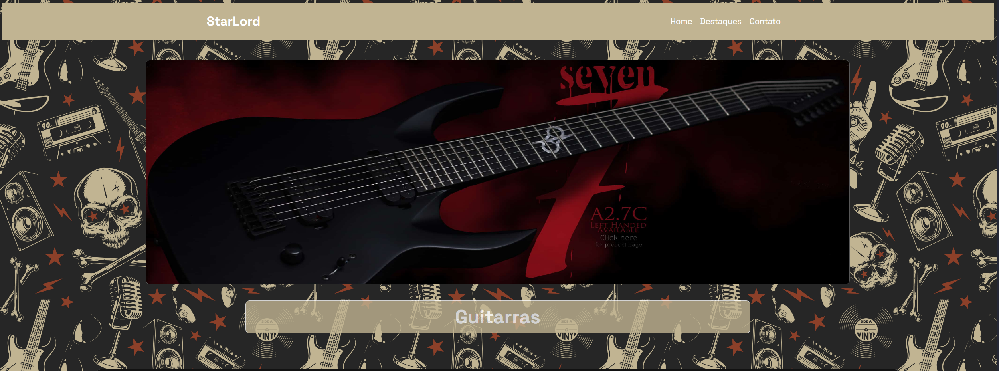

<h1>🎸 StarLord</h1>
<h2>Desenvolvido por: 💻 Pedro Henrique Xavier Constancio</h2>

## ✔️ Tecnologias utilizadas no projeto

- 📚 HTML
- 📚 CSS

## 🤘🏼 Histórias de Guitarras: Um Site Dedicado à Música e à História

Bem-vindo ao nosso site, onde celebramos a beleza e a diversidade das guitarras. Aqui, você encontrará uma coleção de histórias fascinantes sobre a criação de alguns dos instrumentos mais icônicos do mundo.

Cada guitarra tem uma história única para contar. Desde os primeiros modelos rudimentares até os instrumentos mais sofisticados de hoje, cada guitarra carrega consigo a paixão, a criatividade e a dedicação de seus criadores.
Nosso site explora essas histórias, mergulhando na história da guitarra, nos processos de fabricação e nos talentosos luthiers que moldaram o mundo da música. Você descobrirá como diferentes materiais, técnicas e designs contribuíram para a evolução da guitarra e como cada instrumento se tornou uma extensão do artista que o toca.

